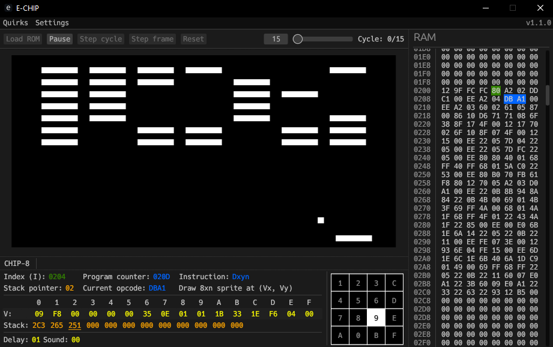

# E-Chip

E-Chip is a desktop CHIP-8 interpreter with real-time profiling UI made with Rust and [egui](https://github.com/emilk/egui).

E-Chip supports all CHIP-8 and SUPER-CHIP features and passes all [tests by Timendus](https://github.com/Timendus/chip8-test-suite?tab=readme-ov-file#flags-test).

This emulator is actually my second attempt at this: the first one did not have a UI and I got stuck on vblanks and the `Fx0A` (wait for key) instruction.

# Features

- All original CHIP-8 instructions and features (including sound)
- All SUPER-CHIP 1.1 instructions and features
- Configurable interpreter quirks
- Binary ROM loading
- Execution of one cycle/frame at a time
- Real-time view of registers, key presses and RAM
- Configurable display colors

## Possible future features

In the future I may implement some of these other features:

- XO-CHIP support
- Editing registers, RAM, etc. with the UI
- Web version
- Loading custom quirk and color presets, saving app settings

# Usage

Download the exe in the Releases tab and run it.

Press "Load ROM" and enter a path to a binary CHIP-8 ROM file to load it into the emulator. You can then press "Run" to start the interpreter, "Step cycle" to execute one cycle or "Step frame" to execute one frame.  
The "Cycles" counter shows shows the progress of the current frame. You can set yourself how many cycles to execute per frame.  
Press "Reset" to reset the interpreter to its inital state and reload the ROM (it will be loaded from the app's memory, not the original file).

To change what CHIP-8 variant the interpreter runs as, click the "CHIP-8" text in the bottom panel.

The "Quirks" tab allows configuration of interpreter quirks as specified in [Timendus' quirks test ROM](https://github.com/Timendus/chip8-test-suite?tab=readme-ov-file#quirks-test). The quirks have tooltips to explain what they do.

The "Settings" tab has some miscellaneous features. Display settings let you customize the display colors (comes with a few presets).

## Shortcuts

| Function          | Keys
| -                 | -
| Run/Pause         | <kbd>Space</kbd>
| Step cycle        | <kbd>.</kbd>
| Step frame        | <kbd>Shift</kbd> + <kbd>.</kbd>
| Reset             | <kbd>Ctrl</kbd> + <kbd>R</kbd>
| Open file         | <kbd>Ctrl</kbd> + <kbd>O</kbd>
| View ROM          | <kbd>Ctrl</kbd> + <kbd>P</kbd>
| Display settings  | <kbd>Ctrl</kbd> + <kbd>D</kbd>
| Toggle sound      | <kbd>Ctrl</kbd> + <kbd>S</kbd>

You can down the step keys to go fast!

# Profiling

E-Chip has several panels that show the current state of the interpreter.

## Interpreter state

The bottom panel shows the values of the registers, stack, timers and the current instruction. The stack view will highlight the current top value. It also show when the interpreter is waiting for a key press.  
The top section lets you select which CHIP-8 variant to run as and shows information specific to it.  
The keypad shows what keys are currently pressed on the CHIP-8 keypad layout.

## RAM view

This RAM panel shows interpreter memory as hex bytes. The bytes that are pointed to by the program counter and I register will have a blue and green background respectively.

## ROM view

This window shows the ROM that is currently stored by the app and will be loaded into the interpreter when pressing "Reset".

# Persistent storage

E-CHIP will save SUPER-CHIP's persistent flags in a file named "flags.dat" in the directory of the executable.

Emulator settings are not yet saved and will be reset on restarts.

# Resources

[Timendus' CHIP-8 test suite](https://github.com/Timendus/chip8-test-suite) - testing the emulator and quirk reference  
[CHIP-8 Variant Opcode Table](https://chip8.gulrak.net) - opcode and quirk reference  
[Octo](https://johnearnest.github.io/Octo/) - implementation reference (`Dxyn` and `Fx0A`), SUPER-CHIP <!-- and XO-CHIP not implemented yet --> reference  
https://github.com/mattmikolay/chip-8 - tests and technical reference
https://github.com/shonumi/Emu-Docs/tree/master - good emulator references  
https://github.com/JohnEarnest/chip8Archive - CHIP-8 ROMs  
https://tobiasvl.github.io/blog/write-a-CHIP-8-emulator - technical reference  
[Cowgod's CHIP-8 Technical Reference](http://devernay.free.fr/hacks/chip8/C8TECH10.HTM) - technical reference  
https://github.com/Chromatophore/HP48-Superchip - SUPER-CHIP info and legacy scrolling