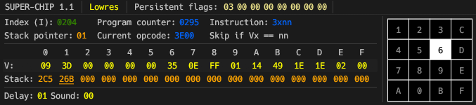

# Deep-Chip

Deep-Chip is a desktop CHIP-8 interpreter with real-time debug UI made with Rust and [egui](https://github.com/emilk/egui).

  
(The gif is from an older version, the current UI looks differently)

Deep-Chip supports all the original CHIP-8 features and passes all [tests by Timendus](https://github.com/Timendus/chip8-test-suite?tab=readme-ov-file#flags-test).

This emulator is actually my second attempt at this: the first one did not have a UI and I got stuck on vblanks and the `Fx0A` (wait for key) instruction.

# Features

- All original CHIP-8 instructions and features (including sound)
- Configurable interpreter quirks
- Binary ROM loading
- Execution of one cycle/frame at a time
- Real-time view of registers, key presses and RAM
- Configurable display colors

## Possible future features

In the future I may implement some of these other features:

- SUPER-CHIP support
- XO-CHIP support
- The ability to edit registers, RAM, etc. with the UI
- Better RAM view
- Loading ROMs with file system dialogs
- WebAssembly
- Custom quirk and color presets and persistent app settings

# Usage

Download the exe in the Releases tab and run it.

Press "Load ROM" and enter a path to a binary CHIP-8 ROM file to load it into the emulator. You can then press "Run" to start the interpreter, "Step cycle" to execute exactly one cycle or "Step frame" to execute one frame (500 cycles). Press "Reset" to reset the interpreter to its inital state and reload the ROM (it will be loaded from the app's memory, not the original file). While the interpreter is running, the only available action is "Stop".

The "Quirks" tab allows configuration of interpreter quirks as specified in [Timendus' quirks test ROM](https://github.com/Timendus/chip8-test-suite?tab=readme-ov-file#quirks-test). The quirks have tooltips to explain what they do.

The "Settings" tab allows the user to enable sound and open various inspection panels. Display settings let you customize the display colors (comes with a few presets).

# Inspection

DEEP-CHIP has several panels and windows that show the current state of the interpreter.

## Interpreter state

This panel shows the values of the registers, stack, timers and the current opcode. The stack view will highlight the currently pointed to value.

## Keypad

This panel shows what keys are currently pressed on the CHIP-8 keypad layout. It also shows whether the interpreter is waiting for a key press.

## RAM view

This panel shows the values currently stored in RAM (yes, all 4KB). The bytes that are pointed to by the program counter and I register have a blue and green background respectively.

## ROM view

This window shows the ROM that is currently stored by the app and will be loaded when pressing "Reset".

# Resources

[Timendus' CHIP-8 test suite](https://github.com/Timendus/chip8-test-suite) - testing the emulator and quirk reference  
[CHIP-8 Variant Opcode Table](https://chip8.gulrak.net) - opcode and quirk reference  
[Octo](https://johnearnest.github.io/Octo/) - implementation reference (`Dxyn` and `Fx0A`)  
https://github.com/shonumi/Emu-Docs/tree/master - good emulator references  
https://github.com/JohnEarnest/chip8Archive - CHIP-8 ROMs  
https://tobiasvl.github.io/blog/write-a-CHIP-8-emulator - technical reference  
[Cowgod's CHIP-8 Technical Reference](http://devernay.free.fr/hacks/chip8/C8TECH10.HTM) - technical reference  